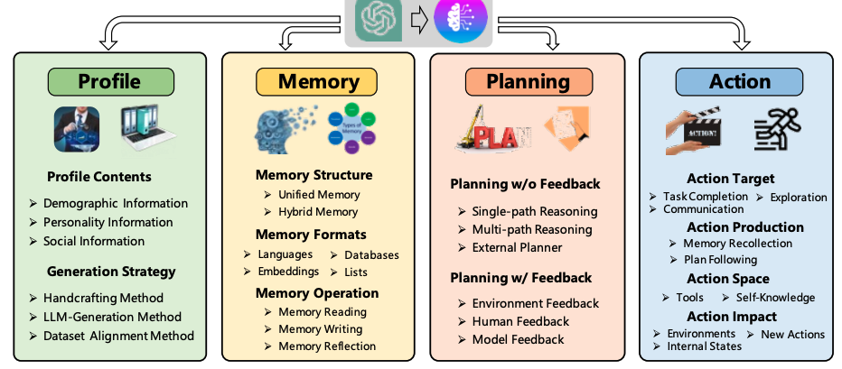

---
date:
  created: 2024-09-02
---

# [論文分析] A Survey on Large Language Model based Autonomous Agents

**設計LLM代理架構：如何支援工作流程、管理記憶與評估效能**

為什麼讀這篇論文：目前正在開發平台，因此選擇這篇論文，想了解代理開發的框架


針對自動化代理平台設計，本篇提供統一框架：
 - 輪廓模組（Profiling Module）：設定代理角色的基本屬性（例如年齡、性別、職業等）。
 - 記憶模組（Memory Module）：短期和長期記憶幫助代理記錄並使用過去的行為來規劃未來。
 - 規劃模組（Planning Module）：代理根據任務分解目標，規劃步驟並調整行動。
 - 行動模組（Action Module）：將規劃轉化為具體的行為並與環境互動。

 

將會針對Profiling Module和Planning Module進行筆記；

### 1. 該選用哪一種Profiling Module的方法？

針對此篇paper介紹的Profiling Module三種方法，整理成表格：

|       | Handcrafting Method | LLM-generation Method | Dataset Alignment Method |
|-------|---------------------|-----------------------|--------------------------|
| **簡介** | 手動設計代理的配置，包括人格特徵和職責。 | 利用LLM自動生成代理配置，基於配置生成規則和少樣本示例。 | 基於真實數據集或現有用戶行為數據來對齊代理行為，模擬真實世界的反應。 |
| **優點** | 靈活性強，可以根據需要分配任意配置。 | 在處理大量代理時節省時間。 | 基於真實數據生成代理行為，能夠反映現實情境，可信度高。 |
| **缺點** | 處理大量代理時，可能非常耗時且勞動密集。 | 可能無法精確控制生成的配置。 | 需要大量高質量的數據，且代理的靈活性受限於數據內容。 |
| **相關project** | Generative Agent、MetaGPT、ChatDev、Self-collaboration 和 PTLLM | RecAgent | SocialSimulacra、GPT-3 和 Amercian National Election Studies (ANES) |

示範代碼

**Handcrafting Method**
```python
from langchain.prompts import PromptTemplate
from langchain.llms import OpenAI

# 定義手工設計的代理角色和行為
template = """
你是一位非常有經驗的軟體開發顧問，你需要幫助一個新手開發者設計一個簡單的聊天機器人。請具體描述設計過程的步驟。
"""
prompt = PromptTemplate(input_variables=[], template=template)

llm = OpenAI(model="gpt-3.5-turbo") # 使用OpenAI作為LLM
response = llm(prompt.format())
print(response)
```

**LLM-generation Method**
```python
from langchain.prompts import FewShotPromptTemplate
from langchain.llms import OpenAI

# 定義少量範例來生成更多代理角色
examples = [
    {"role": "軟體開發者", "behavior": "你需要為一個簡單的網站設計後端邏輯"},
    {"role": "數據科學家", "behavior": "你需要分析一個銷售數據集，並找出關鍵趨勢"}
]

# 定義 Few-shot Prompt
example_formatter = lambda example: f"角色: {example['role']}\n行為: {example['behavior']}\n"
template = FewShotPromptTemplate(
    examples=examples,
    example_prompt=example_formatter,
    prefix="這裡有兩個不同的角色例子，請生成一個新的角色並描述其行為。",
    input_variables=["role"]
)

llm = OpenAI(model="gpt-3.5-turbo")
new_role = "系統管理員"
response = llm(template.format(role=new_role))
print(response)
```

**Dataset Alignment Method**
```python
from langchain.prompts import PromptTemplate
from langchain.chains import LLMChain
from langchain.llms import OpenAI
import pandas as pd

# 假設我們有一個數據集，包含不同年齡段的用戶及其喜歡的電影類型
data = pd.DataFrame({
    "age_group": ["18-25", "26-35", "36-50"],
    "preferred_genre": ["動作片", "愛情片", "紀錄片"]
})

# 根據年齡段生成代理行為
template = """
根據用戶的年齡段 {age_group}，請推薦他們可能喜歡的電影類型：{preferred_genre}。
"""
prompt = PromptTemplate(input_variables=["age_group", "preferred_genre"], template=template)

llm = OpenAI(model="gpt-3.5-turbo")

for index, row in data.iterrows():
    chain = LLMChain(llm=llm, prompt=prompt)
    response = chain.run({"age_group": row['age_group'], "preferred_genre": row['preferred_genre']})
    print(response)
```


### 2. 如何有效管理和調用代理的記憶與歷史數據？

 

### 一、無反饋規劃 (Planning without Feedback)

| 策略              | 代表方法                                           | 特點                                                    | 優點                                                    | 缺點                                                    |
|-------------------|---------------------------------------------------|-------------------------------------------------------|--------------------------------------------------------|--------------------------------------------------------|
| 單路徑推理        | Chain of Thought (CoT), Zero-shot-CoT, RePrompting, ReWOO, HuggingGPT | 將任務分解為幾個中間步驟，以級聯方式連接             | 簡單直觀，易於實現；適合處理線性思維的任務            | 缺乏靈活性，無法處理複雜任務；容易受到早期錯誤的影響 |
| 多路徑推理        | Self-consistent CoT (CoT-SC), Tree of Thoughts (ToT), RecMind, Graph of Thoughts (GoT) | 步驟組織成樹狀結構，每個步驟可能有多個後續步驟       | 更接近人類思維，能考慮多種可能性；適合複雜任務        | 計算成本高，可能導致決策困難                          |
| 外部規劃器        | LLM+P, LLM-DP, CO-LLM                             | 利用外部規劃器生成計劃                              | 能利用高效規劃算法，適合特定領域的問題               | 需要額外的轉換步驟，可能受限於外部規劃器的能力      |

### 二、有反饋規劃 (Planning with Feedback)

| 反饋來源          | 代表方法                                           | 特點                                                    | 優點                                                    | 缺點                                                    |
|-------------------|---------------------------------------------------|-------------------------------------------------------|--------------------------------------------------------|--------------------------------------------------------|
| 環境反饋          | ReAct, Voyager, Ghost, SayPlan, DEPS, LLM-Planner, Inner Monologue | 從客觀世界或虛擬環境獲取反饋                         | 能適應動態變化的環境，更接近真實世界的解決方式       | 需要設計環境模擬器，可能需要大量試錯過程             |
| 人類反饋          | Inner Monologue                                   | 直接與人類互動獲取反饋                               | 更好對齊人類價值觀，有助於緩解幻覺問題               | 需要人類持續參與，成本高；可能受人類偏見影響        |
| 模型反饋          | Self-refine, SelfCheck, InterAct, ChatCoT, Reflexion | 使用預訓練模型生成內部反饋                           | 不需外部資源，自主改進；提供詳細的語言反饋           | 可能受模型局限性影響，難以引入新信息                  |

### 結論
以目前開發架構，為了快速產生一個基礎架構，會先使用handcrafting method 搭配ReAct進行